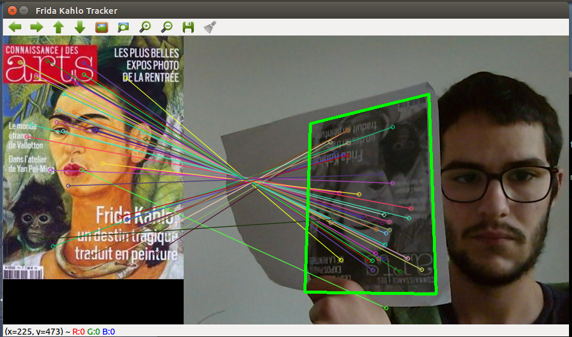

# Tracker d'objet avec opencv

## Installation

L'installation via la commande
`sudo apt-get install libopencv-dev libcv-dev`
fournirait donc une version incomplète d'open-cv

Il faut donc télécharger le code de source d'opencv est le compiler.
Depuis la version 3.0 les algorithmes brevetés, notamment SIFT et SURF, ont été déplacé sur un projet distinct `opencv-contrib`, disponible sur github.

Voici la procédure d'installation:

* Cloner le dépot officiel d'opencv

````
cd ~

git clone https://github.com/Itseez/opencv.git

cd opencv
````

* Cloner le dépôt des modules complémentaires

````
git clone https://github.com/Itseez/opencv_contrib
````

* Installer les dépendances nécessaire à la compilation

````
sudo apt-get update

sudo apt-get install build-essential

sudo apt-get install cmake git libgtk2.0-dev pkg-config libavcodec-dev libavformat-dev libswscale-dev

sudo apt-get install python-dev python-numpy libtbb2 libtbb-dev libjpeg-dev libpng-dev libtiff-dev libjasper-dev libdc1394-22-dev
````
* Compilation

````
mkdir build

cd build

cmake cmake -D OPENCV_EXTRA_MODULES_PATH=../opencv_contrib/modules -D
CMAKE_INSTALL_PREFIX=/usr/local ..

make -j4

sudo make install
````

## Results


